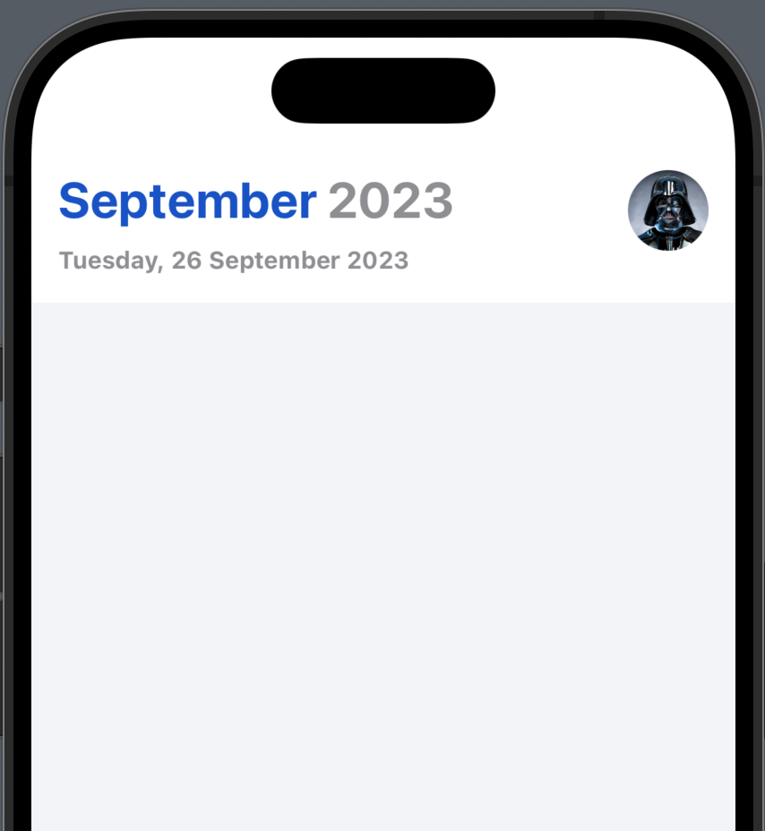
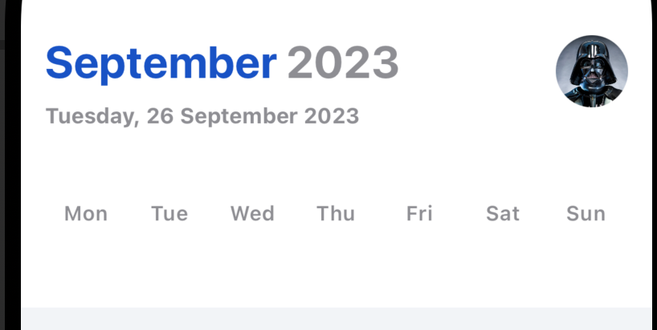
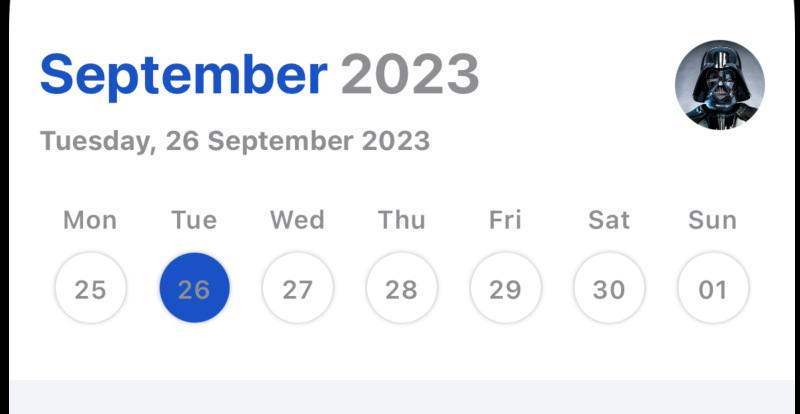
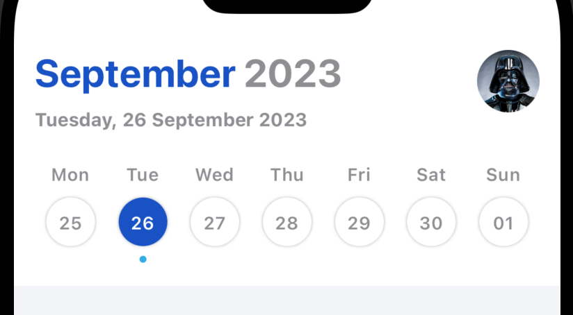

# Task Manager SwiftData


Tworzymy nowy projekt (nie wybieramy SwiftData w oknie początkowym - nawrzuca nam mnóstwo śmieci). W Assets definiujemy kolory:

 BG bialy, DarkBlue, TaskColor1 - TaskColor4. Kolory dajemy wg uznania.


Dodajemy grupe Model i w niej definiujemy Task

```swift
struct Task: Identifiable {
    var id: UUID = .init()
    var taskTitle: String
    var creationDate: Date = .init()
    var isCompleted: Bool = false
    var tint: Color
}

var sampleTasks: [Task] = [
    .init(taskTitle: "Record Video", creationDate: .updateHour(-1), isCompleted: true, tint: .taskColor1),
    .init(taskTitle: "Redesign Website", creationDate: .updateHour(9), tint: .taskColor2),
    .init(taskTitle: "Go for a Walk", creationDate: .updateHour(10), tint: .taskColor3),
    .init(taskTitle: "Edit Video", creationDate: .updateHour(0), tint: .taskColor4),
    .init(taskTitle: "Publish Video", creationDate: .updateHour(2), tint: .taskColor1),
    .init(taskTitle: "Tweet about new Video!", creationDate: .updateHour(12), tint: .taskColor5),
]
```

przy okazji dodajemy kilka rekordow przykładowych, przydadza sie w podglądzie.

Potrzebujemy tu do wyliczania czasu dodatkową funkcję:


```swift
extension Date {
    static func updateHour(_ value: Int) -> Date {
        let calendar = Calendar.current
        return calendar.date(byAdding: .hour, value: value, to: .init()) ?? .init()
    }
  
      struct WeekDay: Identifiable {
        var id: UUID = .init()
        var date: Date
    }
}
```


Tworzymy grupe Helpers i dodajemy tam 2 pliki 

View+Extensions gdzie bedziemy mieli funkcje wykorzystywane w widokach

```swift
/// Custom View Extensions
extension View {
    /// Custom Spacers
    @ViewBuilder
    func hSpacing(_ alignment: Alignment) -> some View {
        self
            .frame(maxWidth: .infinity, alignment: alignment)
    }

    @ViewBuilder
    func vSpacing(_ alignment: Alignment) -> some View {
        self
            .frame(maxHeight: .infinity, alignment: alignment)
    }
}
```


Oraz Date+Extensions

```swift
/// Date Extensions Needed for Building UI
extension Date {
    /// Custom Date Format
    func format(_ format: String) -> String {
        let formatter = DateFormatter()
        formatter.dateFormat = format
        
        return formatter.string(from: self)
    }
}
```


oba bedziemy rozbudowywac w dlaszej czesci projektu.


Modyfikujemy ContentView dodajac wywolanie podstawowego widoku aplikacji:

```swift
struct ContentView: View {
    var body: some View {
        Home()
            .frame(maxWidth: .infinity, maxHeight: .infinity)
            .background(.BG)
            .preferredColorScheme(.light)
    }
}
```


Teraz definiujemy ten widok w grupie Views

```swift
struct Home: View {

    /// Task Manager Properties
    @State private var currentDate: Date = .init()

    var body: some View {
        VStack(alignment: .leading, spacing: 0, content: {
            HeaderView()

        })
    }
}
```


w preview ustawmy aby pokazywal ContentView zamiast Home

```swift
#Preview {
    ContentView()
}
```

zajmijmy sie nagłówkiem :

```swift
    /// Header View
    @ViewBuilder
    func HeaderView() -> some View {
        VStack(alignment: .leading, spacing: 6) {
            HStack(spacing: 5) {
                Text(currentDate.format("MMMM"))
                    .foregroundStyle(.darkBlue)

                Text(currentDate.format("YYYY"))
                    .foregroundStyle(.gray)
            }
            .font(.title.bold())
            Text(currentDate.formatted(date: .complete, time: .omitted))
                .font(.callout)
                .fontWeight(.semibold)
                .textScale(.secondary)
                .foregroundStyle(.gray)
        }
      // tu wstawimy overlay z obrazkiem
        .padding(15)
        .hSpacing(.leading) // wyrównanie do lewej
        .background(.white)
    }

```

 zlewej strony dodamy ikonke np na zdjecie uzytkownika ;)

```swift
VStack{...}
.overlay(alignment: .topTrailing, content: {
  Button(action: {}, label: {
    Image(.picture)
    .resizable()
    .aspectRatio(contentMode: .fill)
    .frame(width: 45, height: 45)
    .clipShape(.circle)
  })
})
```

do assets musimy dodac jakis obrazek o nazwie picture

`.hSpacing(.leading)` przesuwamy przed obrazek, zeby nam go nie przesuwał


główny widok wyrównujemy do górnej krawędzi:

```swift
    var body: some View {
        VStack(alignment: .leading, spacing: 0, content: {
            HeaderView()
        })
        .vSpacing(.top)
    }
```


dotychczasowy kod w całości :

```swift
struct Home: View {

    /// Task Manager Properties
    @State private var currentDate: Date = .init()

    var body: some View {
        VStack(alignment: .leading, spacing: 0, content: {
            HeaderView()
        })
        .vSpacing(.top)
    }

    /// Header View
    @ViewBuilder
    func HeaderView() -> some View {
        VStack(alignment: .leading, spacing: 6) {
            HStack(spacing: 5) {
                Text(currentDate.format("MMMM"))
                    .foregroundStyle(.darkBlue)

                Text(currentDate.format("YYYY"))
                    .foregroundStyle(.gray)
            }
            .font(.title.bold())
            Text(currentDate.formatted(date: .complete, time: .omitted))
                .font(.callout)
                .fontWeight(.semibold)
                .textScale(.secondary)
                .foregroundStyle(.gray)
        }
        .hSpacing(.leading) // wyrównanie do lewej
        .overlay(alignment: .topTrailing, content: {
          Button(action: {}, label: {
            Image(.picture)
            .resizable()
            .aspectRatio(contentMode: .fill)
            .frame(width: 45, height: 45)
            .clipShape(.circle)
          })
        })
        .padding(15)

        .background(.white)
    }
}

#Preview {
    ContentView()
}

```





i uzyskany efekt powyżej.


### Kalendarz z przewijaniem


w Date+Helper

dodajemy klase pozwalająca uzyskać tablice dni z bieżącego tygodnia:

```swift
    /// Fetching Week Based on given Date
    func fetchWeek(_ date: Date = .init()) -> [WeekDay] {
        let calendar = Calendar.current
        let startOfDate = calendar.startOfDay(for: date)
        
        var week: [WeekDay] = []
        let weekForDate = calendar.dateInterval(of: .weekOfMonth, for: startOfDate)
        guard let starOfWeek = weekForDate?.start else {
            return []
        }
        
        /// Iterating to get the Full Week
        (0..<7).forEach { index in
            if let weekDay = calendar.date(byAdding: .day, value: index, to: starOfWeek) {
                week.append(.init(date: weekDay))
            }
        }
        
        return week
    }
```


 wracamy do Home

i definiujemy zmienna do przechowywania dni tygodnia 

```swift
struct Home: View {

    /// Task Manager Properties
    @State private var currentDate: Date = .init()
    @State private var weekSlider: [[Date.WeekDay]] = []
    @State private var currentWeekIndex: Int = 1
```


Na koncu Header View po polu Text(currentdate) dodajemy TabView, ktory bedzie wyświetlał dni tygodnia

```swift
            /// Week Slider
            TabView(selection: $currentWeekIndex) {
                ForEach(weekSlider.indices, id: \.self) { index in
                    let week = weekSlider[index]
                    WeekView(week)
                        .padding(.horizontal, 15)
                        .tag(index)
                }
            }
            .padding(.horizontal, -15)
            .tabViewStyle(.page(indexDisplayMode: .never))
            .frame(height: 90)
```


i zaczynamy budowac Week View

```swift
    /// Week View
    @ViewBuilder
    func WeekView(_ week: [Date.WeekDay]) -> some View {
        HStack(spacing: 0) {
            ForEach(week) { day in
                VStack(spacing: 8) {
                    Text(day.date.format("E"))
                        .font(.callout)
                        .fontWeight(.medium)
                        .textScale(.secondary)
                        .foregroundStyle(.gray)
                }
                .hSpacing(.center)
            }
        }
    }
```




niżej dodajemy pętle podobną po dniach tygodnia:

```swift
Text(day.date.format("dd"))
.font(.callout)
.fontWeight(.medium)
.textScale(.secondary)
.foregroundStyle(.gray)
.frame(width: 35,height: 35)
.background(.white.shadow(.drop(radius: 1)),in: .circle)
```


Teraz dodajmy oznaczenie, który dzien jest bieżący.

w Date Helper dodajmy funkcje:

```swift
    /// Checking Whether the Date is Today
    var isToday: Bool {
        return Calendar.current.isDateInToday(self)
    }
```

W View+Helper dodamy funkcje porownujaca 2 daty:

```swift
    /// Checking Two dates are same
    func isSameDate(_ date1: Date, _ date2: Date) -> Bool {
        return Calendar.current.isDate(date1, inSameDayAs: date2)
    }
```


i zaraz za .frame() dodajemy kod dodajacy tło wskazujaca wybrany dzień :

```swift
.background(content: {
  if isSameDate(day.date, currentDate){
    Circle()
    .fill(.darkBlue)
  }
})
```





jak widac 26 jest szare, wiec warto zmodyfikowac kolor na inny - np biały:

`.foregroundStyle(isSameDate(day.date, currentDate) ? .white : .gray)`

Poda datą wskazująca na dzisiaj dodamy znacznik w pzostacji kropki:

```swift
/// Indicator to Show, Which is Today;s Date
if day.date.isToday {
  Circle()
  .fill(.cyan)
  .frame(width: 5, height: 5)
  .vSpacing(.bottom)
  .offset(y: 12)
}
```




Teraz dodamy obsluge ustawienia wybranej daty w zaleznosci od kliknietego dnia na widoku tygodnia:

```swift
                .contentShape(.rect)
                .onTapGesture {
                    /// Updating Current Date
                    withAnimation(.snappy) {
                        currentDate = day.date
                    }
                }
```


`.contentShape(.rect)`:  ustawia kształt obszaru zawartości, który reaguje na gesty. W tym przypadku ustawiamy go na prostokąt (`rect`), co oznacza, że wszystkie gesty, takie jak naciśnięcia, zostaną zarejestrowane tylko wewnątrz prostokątnego obszaru widoku.


.gif)

W nagłówku dodajmy namespace do animacji:

```swift
    /// Animation Namespace
@Namespace private var animation
```

i do znacznika wybranego dnia dodajmy animacje:

```swift
.matchedGeometryEffect(id: "TABINDICATOR", in: animation)
```


.gif)


Funkcja FetchWeek generuje tablice na biezacy tydzień , tydzien przed i po. Jesli przewijamy dalej, nalezy dogenerowac kolejne dni:

W Date+Helper dodajemy funkcje generujace tablece dni:

```swift
    /// Creating Next Week, based on the Last Current Week's Date
    func createNextWeek() -> [WeekDay] {
        let calendar = Calendar.current
        let startOfLastDate = calendar.startOfDay(for: self)
        guard let nextDate = calendar.date(byAdding: .day, value: 1, to: startOfLastDate) else {
            return []
        }
        
        return fetchWeek(nextDate)
    }
    
    /// Creating Previous Week, based on the First Current Week's Date
    func createPreviousWeek() -> [WeekDay] {
        let calendar = Calendar.current
        let startOfFirstDate = calendar.startOfDay(for: self)
        guard let previousDate = calendar.date(byAdding: .day, value: -1, to: startOfFirstDate) else {
            return []
        }
        
        return fetchWeek(previousDate)
    }
```


modyfikujemy kod ladujacy te dni 

```swift
        .onAppear(perform: {
            if weekSlider.isEmpty {
                let currentWeek = Date().fetchWeek()

                if let firstDate = currentWeek.first?.date {
                    weekSlider.append(firstDate.createPreviousWeek())
                }

                weekSlider.append(currentWeek)

                if let lastDate = currentWeek.last?.date {
                    weekSlider.append(lastDate.createNextWeek())
                }
            }
        })
```


Na headerView dodajemy 

```swift
        .onChange(of: currentWeekIndex, initial: false) { oldValue, newValue in
            /// Creating When it reaches first/last Page
            if newValue == 0 || newValue == (weekSlider.count - 1) {
                createWeek = true
            }
        }
```


dodajemy kolejną strukturę osobnym pliku

```swift
import SwiftUI

struct OffsetKey: PreferenceKey {
    static var defaultValue: CGFloat = 0
    static func reduce(value: inout CGFloat, nextValue: () -> CGFloat) {
        value = nextValue()
    }
}

```

funkcje w widoku Home:

```swift
    func paginateWeek() {
        /// SafeCheck
        if weekSlider.indices.contains(currentWeekIndex) {
            if let firstDate = weekSlider[currentWeekIndex].first?.date, currentWeekIndex == 0 {
                /// Inserting New Week at 0th Index and Removing Last Array Item
                weekSlider.insert(firstDate.createPreviousWeek(), at: 0)
                weekSlider.removeLast()
                currentWeekIndex = 1
            }
            
            if let lastDate = weekSlider[currentWeekIndex].last?.date, currentWeekIndex == (weekSlider.count - 1) {
                /// Appending New Week at Last Index and Removing First Array Item
                weekSlider.append(lastDate.createNextWeek())
                weekSlider.removeFirst()
                currentWeekIndex = weekSlider.count - 2
            }
        }
        
        print(weekSlider.count)
    }
```


na koncu weekview dodajemy funkcje: 

```swift
       .background {
            GeometryReader {
                let minX = $0.frame(in: .global).minX

                Color.clear
                    .preference(key: OffsetKey.self, value: minX)
                    .onPreferenceChange(OffsetKey.self) { value in
                        /// When the Offset reaches 15 and if the createWeek is toggled then simply generating next set of week
                        if value.rounded() == 15 && createWeek {
                            paginateWeek()
                            createWeek = false
                        }
                    }
            }
        }
```


Kompletny widok WeekView

```swift
    /// Week View
    @ViewBuilder
    func WeekView(_ week: [Date.WeekDay]) -> some View {
        HStack(spacing: 0) {
            ForEach(week) { day in
                VStack(spacing: 8) {
                    Text(day.date.format("E"))
                        .font(.callout)
                        .fontWeight(.medium)
                        .textScale(.secondary)
                        .foregroundStyle(.gray)
                    
                    Text(day.date.format("dd"))
                        .font(.callout)
                        .fontWeight(.bold)
                        .textScale(.secondary)
                        .foregroundStyle(isSameDate(day.date, currentDate) ? .white : .gray)
                        .frame(width: 35, height: 35)
                        .background(content: {
                            if isSameDate(day.date, currentDate) {
                                Circle()
                                    .fill(.darkBlue)
                                    .matchedGeometryEffect(id: "TABINDICATOR", in: animation)
                            }
                            
                            /// Indicator to Show, Which is Today;s Date
                            if day.date.isToday {
                                Circle()
                                    .fill(.cyan)
                                    .frame(width: 5, height: 5)
                                    .vSpacing(.bottom)
                                    .offset(y: 12)
                            }
                        })
                        .background(.white.shadow(.drop(radius: 1)), in: .circle)
                }
                .hSpacing(.center)
                .contentShape(.rect)
                .onTapGesture {
                    /// Updating Current Date
                    withAnimation(.snappy) {
                        currentDate = day.date
                    }
                }
            }
        }
        .background {
            GeometryReader {
                let minX = $0.frame(in: .global).minX
                
                Color.clear
                    .preference(key: OffsetKey.self, value: minX)
                    .onPreferenceChange(OffsetKey.self) { value in
                        /// When the Offset reaches 15 and if the createWeek is toggled then simply generating next set of week
                        if value.rounded() == 15 && createWeek {
                            paginateWeek()
                            createWeek = false
                        }
                    }
            }
        }
    }
```


### TaskView

